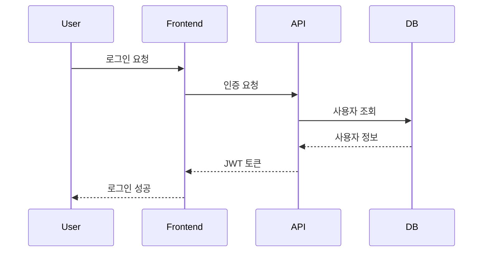

# 9장: Image Generation - AI로 이미지 생성

> **텍스트 설명만으로 이미지를 생성할 수 있습니다**

## 📋 목차

- [강의 개요](#-강의-개요)
- [1부: Image Generation이란?](#1부-image-generation이란)
- [2부: 기본 사용법](#2부-기본-사용법)
- [3부: UI 목업 생성](#3부-ui-목업-생성)
- [4부: 다이어그램 생성](#4부-다이어그램-생성)
- [5부: 이미지 관리](#5부-이미지-관리)
- [실습 프로젝트](#-실습-프로젝트)

---

## 📝 강의 개요

Cursor Agent는 이제 **이미지도 생성**할 수 있습니다!

텍스트 설명만으로 UI 목업, 아이콘, 로고, 다이어그램 등을 만들 수 있습니다. 디자이너 없이도 빠르게 프로토타입을 만들거나, 아키텍처를 시각화할 수 있습니다.

**학습 목표**:

- Image Generation 기본 사용법
- UI 목업 생성 (버튼, 아이콘, 로고)
- 다이어그램 생성 (아키텍처, 플로우차트)
- 이미지 저장 및 관리
- 실전 활용 패턴

**공식 문서**:
- [체인지로그 - Image Generation (2026.01.22)](https://cursor.com/changelog)
- [프로토타이핑](https://cursor.com/for/prototyping) - 빠른 프로토타이핑 가이드
- [Mermaid 다이어그램](https://cursor.com/docs/cookbook/mermaid-diagrams) - 다이어그램 생성
- [Agent 개요](https://cursor.com/docs/agent/overview)

---

## 1부: Image Generation이란?

### 개념

Cursor Agent에게 텍스트로 설명하면 **이미지를 생성**해주는 기능입니다.

```
You: 파란색 로그인 버튼 이미지 만들어줘

Agent: [이미지 생성]
       → assets/ 폴더에 저장됨
       → 인라인 미리보기 표시
```

### 사용 모델

**Google Nano Banana Pro** 모델을 사용합니다.

- 빠른 생성 속도
- 높은 품질
- 텍스트 및 참조 이미지 지원

### 기존 방식 vs Image Generation

**기존 방식**:
```
1. 디자이너에게 요청
2. 디자인 도구 사용 (Figma, Sketch)
3. 이미지 에셋 준비
4. 개발에 적용

→ 시간 소요: 수 시간 ~ 수 일
```

**Image Generation**:
```
1. Agent에게 설명
2. 이미지 생성
3. 바로 사용

→ 시간 소요: 수 초 ~ 수 분
```

---

## 2부: 기본 사용법

### 텍스트 설명으로 생성

```
You: 간단한 로고 만들어줘.
     파란색 원 안에 흰색 "C" 글자가 있는 로고

Agent: [이미지 생성]
       
       생성된 이미지:
       [미리보기 표시]
       
       저장 위치: assets/logo.png
```

### 참조 이미지 사용

```
You: @existing-logo.png 이 로고를 참고해서
     색상만 빨간색으로 바꿔줘

Agent: [참조 이미지 분석]
       [새 이미지 생성]
       
       저장 위치: assets/logo-red.png
```

### 상세한 설명

더 상세하게 설명할수록 원하는 결과를 얻을 수 있습니다.

```
You: 로그인 버튼 이미지 만들어줘.
     
     요구사항:
     - 크기: 200x50px
     - 배경: 파란색 그라데이션 (#4A90E2 → #2E5C8A)
     - 텍스트: "로그인" (흰색, 16px, 중앙 정렬)
     - 모서리: 둥글게 (8px border-radius)
     - 그림자: 약간의 drop shadow

Agent: [상세한 이미지 생성]
```

---

## 3부: UI 목업 생성

### 버튼 디자인

```
You: 다음 버튼들을 만들어줘:
     1. Primary 버튼 (파란색)
     2. Secondary 버튼 (회색)
     3. Danger 버튼 (빨간색)
     
     각 버튼은 hover 상태도 포함해줘

Agent: [3개 버튼 × 2개 상태 = 6개 이미지 생성]
       
       assets/button-primary.png
       assets/button-primary-hover.png
       assets/button-secondary.png
       assets/button-secondary-hover.png
       assets/button-danger.png
       assets/button-danger-hover.png
```

### 아이콘 세트

```
You: 간단한 아이콘 세트 만들어줘:
     - 홈 아이콘
     - 검색 아이콘
     - 설정 아이콘
     - 프로필 아이콘
     
     스타일: 미니멀, 선 두께 2px, 24x24px

Agent: [4개 아이콘 생성]
```

### 로고 디자인

```
You: 스타트업 로고 만들어줘.
     
     회사명: TechFlow
     컨셉: 기술과 흐름
     색상: 청록색 계열
     스타일: 모던, 미니멀

Agent: [로고 생성]
       [여러 버전 제안 가능]
```

---

## 🚀 실습: Project 1 - 간단한 이미지 생성

이제 배운 내용을 바로 실습해봅시다!

### [Project 1: 간단한 이미지 생성](./projects/01-image-basic/README.md)

**학습 내용**:

- 기본 이미지 생성 (아이콘, 로고)
- 텍스트 설명 작성 방법
- 이미지 수정 및 최적화

**실습 방식**:

Agent에게 다양한 이미지를 요청하고, 결과를 확인합니다. 설명을 구체적으로 작성하는 방법을 익힙니다.

**실습 예시**:
- "파란색 로그인 버튼 만들어줘" → 간단한 버튼 생성
- "200x50px, 그라데이션, 둥근 모서리..." → 상세한 버튼 생성
- "이 로고를 빨간색으로 바꿔줘" → 참조 이미지 활용

💡 **지금 바로 실습해보세요!** [Project 1 실습 가이드](./projects/01-image-basic/README.md)

---

## 4부: 다이어그램 생성

### 아키텍처 다이어그램

```
You: 마이크로서비스 아키텍처 다이어그램 만들어줘.
     
     구성:
     - API Gateway
     - Auth Service
     - User Service
     - Order Service
     - Database (각 서비스별)
     - Message Queue (RabbitMQ)
     
     화살표로 연결 관계 표시해줘

Agent: [아키텍처 다이어그램 생성]
```

### 플로우차트

```
You: 로그인 플로우차트 만들어줘.
     
     1. 사용자 입력
     2. 유효성 검사
     3. 인증 확인
     4. 성공 → 메인 페이지
     5. 실패 → 에러 메시지

Agent: [플로우차트 생성]
```

### ER 다이어그램

```
You: 블로그 시스템 ER 다이어그램 만들어줘.
     
     테이블:
     - Users (id, name, email)
     - Posts (id, title, content, user_id)
     - Comments (id, content, post_id, user_id)
     
     관계도 표시해줘

Agent: [ER 다이어그램 생성]
```

### Mermaid 다이어그램

Cursor는 **Mermaid 문법**을 사용하여 다이어그램을 생성할 수도 있습니다.

**Mermaid란?**
- 텍스트 기반 다이어그램 도구
- 마크다운에 직접 삽입 가능
- 버전 관리 가능
- 자동 렌더링

**Mermaid 다이어그램 예시**:

```
You: Mermaid로 시퀀스 다이어그램 만들어줘.
     
     로그인 프로세스:
     1. 사용자 → 프론트엔드: 로그인 요청
     2. 프론트엔드 → API: 인증 요청
     3. API → DB: 사용자 조회
     4. DB → API: 사용자 정보
     5. API → 프론트엔드: JWT 토큰
     6. 프론트엔드 → 사용자: 로그인 성공

Agent: [Mermaid 코드 생성]
```



**지원하는 Mermaid 다이어그램 타입**:
- Flowchart (플로우차트)
- Sequence Diagram (시퀀스 다이어그램)
- Class Diagram (클래스 다이어그램)
- State Diagram (상태 다이어그램)
- Entity Relationship Diagram (ER 다이어그램)
- Gantt Chart (간트 차트)
- Pie Chart (파이 차트)
- Git Graph (Git 그래프)

**Mermaid 사용 예시**:

```
You: Mermaid로 플로우차트 만들어줘.
     
     주문 처리 플로우:
     시작 → 재고 확인 → (재고 있음?) 
     → Yes: 결제 처리 → 배송 준비 → 완료
     → No: 재입고 알림 → 완료

Agent: [Mermaid 플로우차트 생성]
```

**참고 문서**: [Mermaid 다이어그램 가이드](https://cursor.com/docs/cookbook/mermaid-diagrams)

---

## 5부: 이미지 관리

### 저장 위치

생성된 이미지는 기본적으로 `assets/` 폴더에 저장됩니다.

```
project/
├── assets/
│   ├── logo.png
│   ├── button-primary.png
│   ├── icon-home.png
│   └── architecture-diagram.png
└── ...
```

### 저장 위치 변경

```
You: 이미지를 public/images/ 폴더에 저장해줘

Agent: [설정 변경]
       이제 public/images/에 저장됩니다
```

### 이미지 수정

```
You: assets/logo.png 이미지를 수정해줘.
     색상을 빨간색으로 바꿔줘

Agent: [기존 이미지 분석]
       [수정된 이미지 생성]
       
       assets/logo-red.png로 저장했습니다
```

### 이미지 최적화

```
You: assets/ 폴더의 모든 이미지를 최적화해줘.
     WebP 형식으로 변환하고 크기도 줄여줘

Agent: [이미지 최적화]
       
       logo.png → logo.webp (50% 크기 감소)
       button.png → button.webp (45% 크기 감소)
```

---

## 🚀 실습: Project 2 - UI 목업 및 다이어그램 생성

이제 실전에서 활용할 수 있는 이미지를 생성해봅시다!

### [Project 2: UI 목업 및 다이어그램 생성](./projects/02-image-mockup/README.md)

**학습 내용**:

- UI 목업 생성 (버튼, 카드, 폼)
- 아키텍처 다이어그램 생성
- 플로우차트 생성
- 실전 프로젝트 적용

**실습 방식**:

실제 프로젝트에 필요한 UI 목업과 다이어그램을 생성합니다. 문서화에 활용하는 방법을 배웁니다.

**실습 예시**:
- 버튼 세트 생성 (Primary, Secondary, Danger)
- 아키텍처 다이어그램 (마이크로서비스 구조)
- 플로우차트 (로그인 플로우)
- README에 이미지 삽입

💡 **지금 바로 실습해보세요!** [Project 2 실습 가이드](./projects/02-image-mockup/README.md)

---

## 💡 실전 활용 패턴

### 1. 빠른 프로토타이핑

```
You: 랜딩 페이지 목업 만들어줘.
     
     섹션:
     - 히어로 섹션 (큰 제목 + CTA 버튼)
     - 기능 소개 (3개 카드)
     - 가격 정보 (3개 플랜)
     - Footer

Agent: [각 섹션 이미지 생성]
       [HTML/CSS도 함께 생성 가능]
```

### 2. 문서화

```
You: README에 사용할 아키텍처 다이어그램 만들어줘

Agent: [다이어그램 생성]
       README.md에 이미지 링크 추가했습니다
```

### 3. 디자인 시스템

```
You: 디자인 시스템 컴포넌트 이미지 만들어줘:
     - 버튼 (5가지 변형)
     - 입력 필드 (3가지 상태)
     - 카드 (2가지 스타일)

Agent: [컴포넌트 이미지 생성]
       design-system/ 폴더에 저장했습니다
```

---

## 💡 학습 가이드

### 진행 방법

1. **1부-2부: Image Generation 기본**
   - Image Generation 개념 이해
   - 기본 사용법 학습 (텍스트 설명, 참조 이미지)

2. **3부: UI 목업 생성 + 실습**
   - 버튼, 아이콘, 로고 생성 방법
   - 👉 **바로 실습**: Project 1 - 간단한 이미지 생성

3. **4부: 다이어그램 생성 + 실습**
   - 아키텍처, 플로우차트, ER 다이어그램
   - 👉 **바로 실습**: Project 2 - UI 목업 및 다이어그램 생성

4. **5부: 이미지 관리 및 실전 활용**
   - 저장, 수정, 최적화
   - 다양한 활용 패턴

### 학습 팁

- 설명은 구체적으로 작성하세요
- 참조 이미지를 활용하면 더 정확합니다
- 여러 버전을 생성해서 비교하세요
- 실제 프로젝트에 바로 적용해보세요

---

## 📊 학습 정리

이번 장에서 다룬 내용:

**1부-2부: Image Generation 기본**
- ✅ Image Generation 기본 개념
- ✅ 텍스트 설명으로 이미지 생성
- ✅ 참조 이미지 활용

**3부: UI 목업 생성 + 실습**
- ✅ UI 목업 생성 (버튼, 아이콘, 로고)
- ✅ **실습 완료**: 간단한 이미지 생성

**4부: 다이어그램 생성 + 실습**
- ✅ 다이어그램 생성 (아키텍처, 플로우차트)
- ✅ **실습 완료**: UI 목업 및 다이어그램 생성

**5부: 이미지 관리 및 실전 활용**
- ✅ 이미지 저장, 수정, 최적화
- ✅ 실전 활용 패턴

**핵심 포인트**:

```
빠른 프로토타이핑 → Image Generation
디자이너 없이 목업 → Image Generation
문서화 시각화 → Image Generation
```

**다음 장 예고**:

10장에서는 **Enterprise Features**를 배웁니다. Cursor Blame, Shared Transcripts 등 팀 협업 기능을 익힙니다.

---

## 🔗 공식 문서

- [체인지로그 - Image Generation (2026.01.22)](https://cursor.com/changelog)
- [Agent 개요](https://cursor.com/docs/agent/overview)

---

## ⏭ 다음 장

[10장: Enterprise Features - 팀 협업 기능](../session-10/README.md)

---

## 🔗 실습 프로젝트 바로가기

- [Project 1: 간단한 이미지 생성](./projects/01-image-basic/README.md) - 3부 학습 후 진행
- [Project 2: UI 목업 및 다이어그램 생성](./projects/02-image-mockup/README.md) - 4부 학습 후 진행
